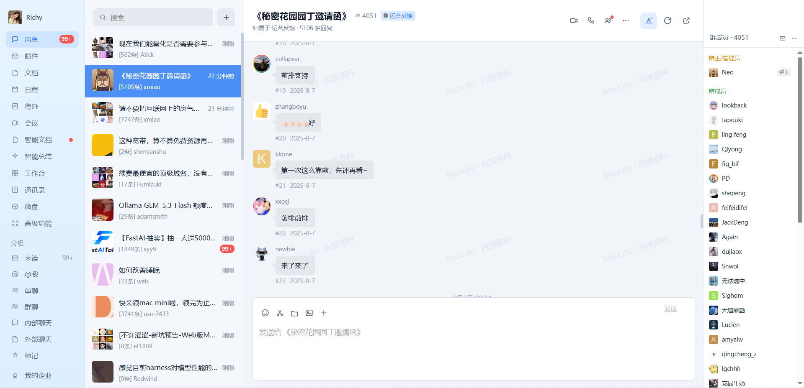
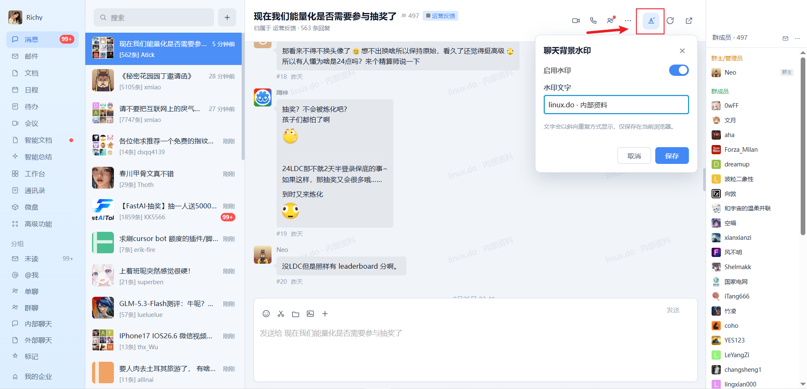
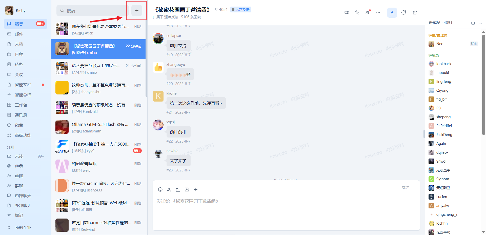
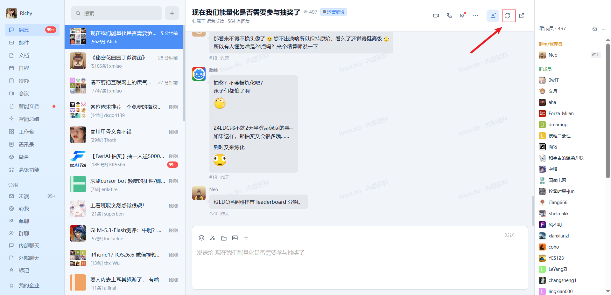
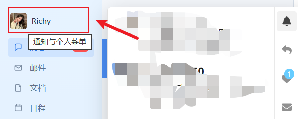

# Linux DO · 企业微信 IM 外观

把 [linux.do](https://linux.do/) 换成 **企业微信 5.x PC 即时消息**风格。只换皮，不碰数据——话题内容、账号、链接、通知、路由与回复交互全部保留。

> 作者：**Richy**


## 安装

1. 安装 [Tampermonkey](https://www.tampermonkey.net/)（或 Violentmonkey）。
2. 打开 [`linuxdo-wecom.user.js`](./linuxdo-wecom.user.js)，在 GitHub 中点击 **Raw** 后安装。
3. 访问 <https://linux.do/>；脚本更新后请硬刷新一次。

Raw 安装入口：[点击以 Raw 方式打开脚本](./linuxdo-wecom.user.js?raw=1)。

## 功能

- **左侧展开导航**：当前用户、消息、邮件、文档、日程、待办、会议、智能文档、智能总结、工作台、通讯录、微盘和高级功能。
- **聊天分组**：未读、@我、单聊、群聊、内部聊天、外部聊天和标记；未读数量随真实话题列表同步。
- **会话列表**：企业微信式搜索框、蓝色选中态、分类标签、未读角标、可拖拽宽度，以及单字 / 九宫格隐私头像。
- **聊天详情**：本人浅蓝气泡、对方灰色气泡、置顶消息、时间分隔、分类标签、点赞和指定楼层回复。
- **群成员栏**：读取真实话题参与者，区分群主与普通成员；窄屏时自动隐藏。
- **自定义水印**：聊天背景默认保持纯色；可自行输入水印文字并开启或关闭，设置写入 `localStorage`。
- **图片预览**：点击聊天图片打开沉浸式大图；右上角“关闭”按钮、点击遮罩和 `Esc` 均可退出。
- **真实交互**：继续使用 Discourse JSON、SPA 路由、原生通知菜单和原生回复编辑器，不复制或伪造站点数据。
- **原生视图切换**：聊天区右上角可随时切回 Linux DO 原版，选择会自动记住。
- **窄屏适配**：宽度小于 `1000px` 时自动在会话列表与聊天详情之间切换。
- **仅浅色模式**：保持企业微信桌面端的浅蓝、灰白视觉，不启用暗夜皮肤。

## 截图

| 场景 | 预览 |
| --- | --- |
| 帖子详情 |  |
| 自定义聊天背景水印 |  |
| 点击展开分类列表 |  |
| 刷新网页 |  |
| Hover 头像通知 |  |

## 本地验证

测试依赖 `agent-browser`：

```powershell
python -B tests\wecom_smoke.py
```

测试覆盖导航与会话布局、搜索框、话题消息、成员栏、水印开关与持久化、图片预览的三种关闭方式，以及原生视图切换。

## 项目结构

```text
linuxdo-wecom-ui/
├─ linuxdo-wecom.user.js
├─ README.md
├─ LICENSE
├─ snapshot/
│  ├─ 帖子详情.png
│  ├─ 自定义聊天背景水印.png
│  ├─ 点击展开分类列表.png
│  ├─ 刷新网页.png
│  └─ hover头像通知.png
└─ tests/
   └─ wecom_smoke.py
```

## License

MIT © 2026 Richy

企业微信为腾讯旗下产品商标。本项目为非官方、非关联作品。

## 友链

- [linux.do](https://linux.do/)
